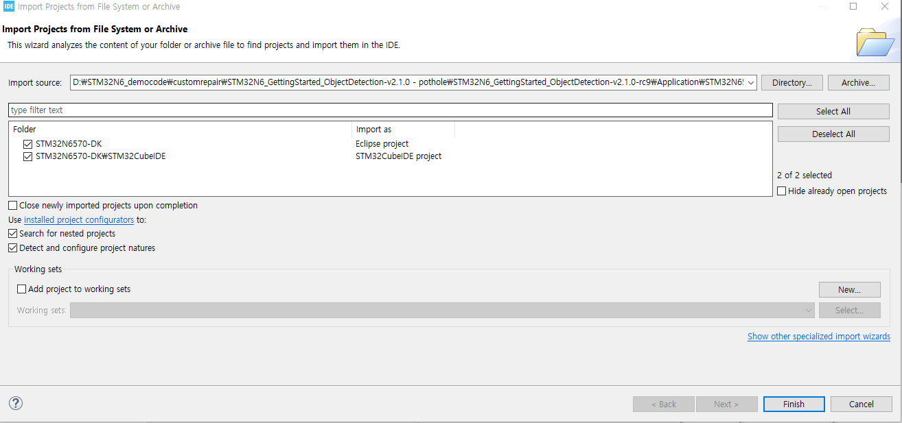

# stm32n6-pothole-detection
Pothole object detection using STM32N6 NPU

# Video

[](https://youtu.be/0sak5Bz9Pt0?t=0s)

# how to run

## Download source code

download ObjectDetection Sourcecode at [https://github.com/STMicroelectronics/STM32N6-GettingStarted-ObjectDetection](https://github.com/STMicroelectronics/STM32N6-GettingStarted-ObjectDetection)

## Download data

download the data at [https://public.roboflow.com/object-detection/pothole](https://public.roboflow.com/object-detection/pothole)

## make model
refer the [pothole_yolo8n.ipynb](basemodel/pothole_yolo8n.ipynb)

Input type of tflite model is uint8 and output type is int8
```py
results = model.train(data="data.yaml", epochs=90, imgsz=480)


converter = tf.lite.TFLiteConverter.from_saved_model('/content/runs/detect/train/weights/best_saved_model')
converter.optimizations = [tf.lite.Optimize.DEFAULT]
converter.representative_dataset = representative_dataset_gen
converter.target_spec.supported_ops = [tf.lite.OpsSet.TFLITE_BUILTINS_INT8]
converter.inference_input_type = tf.uint8  
converter.inference_output_type = tf.int8

tflite_model = converter.convert()
with open('yolov8n_uint8_int8.tflite', 'wb') as f:
  f.write(tflite_model)

print("Successfully converted to uint8 TFLite model!")
```

## Generate C file from tflite
1. Install [STEdgeAI](https://www.st.com/en/development-tools/stedgeai-core.html), [STM32CubeIDE](https://www.st.com/en/development-tools/stm32cubeide.html), and [STM32CubeProgrammer](https://www.st.com/en/development-tools/stm32cubeprog.html)

1. Add `/c/\<InstallFolder>/Utilities/windows/` in your path to have stedgeai known by your bash(In my case, C:\ST\STEdgeAI\2.2\Utilities\windows).

2. Add `/c/\<InstallFolder>/STM32CubeIDE_<X.X.X>/STM32CubeIDE/plugins/com.st.stm32cube.ide.mcu.externaltools.gnu-tools-for-stm32.<X.X.X>/bin/` in your path to have arm-none-eabi-objcopy known by your bash(In my case, C:\ST\STM32CubeIDE_1.19.0\STM32CubeIDE\plugins\com.st.stm32cube.ide.mcu.externaltools.gnu-tools-for-stm32.13.3.rel1.win32_1.0.0.202411081344).

3. Put you tflite model in the `Model` folder.

4. Generate C file
```bash
cd Model
stedgeai generate --model Model_File.tflite --target stm32n6 --st-neural-art default@user_neuralart_STM32N6570-DK.json
cp st_ai_output/network.c STM32N6570-DK/
cp st_ai_output/network_ecblobs.h STM32N6570-DK/
cp st_ai_output/network_atonbuf.xSPI2.raw STM32N6570-DK/network_data.xSPI2.bin
arm-none-eabi-objcopy -I binary STM32N6570-DK/network_data.xSPI2.bin --change-addresses 0x70380000 -O ihex STM32N6570-DK/network_data.hex
```
then `network.c`, `network_data.hex`, `network_data.xSPI2.bin`, `network_ecblobs.h` has been generated in `./Model/STM32N6570-DK`

## Modify code and build project
1. run STM32CubeIDE
2. Click File - Open Projects from File System
3. Click Directory and add directory `STM32N6_GettingStarted_ObjectDetection-v2.1.0-rc9/Application/STM32N6570-DK`



4. Click finish


### Modify app_config.h
If you refer to file `STM32N6570-DK_GettingStarted_ObjectDetection/Application/app_postprocess_xxxxx.c`, you can see which values should be defined according to the yolo version and task

In this case, We use yolov8, so we should refer the app_postprocess_od_yolov8_ui.c. 'ui' means that input type is uint8, and output type is int8

```c
#if POSTPROCESS_TYPE == POSTPROCESS_OD_YOLO_V8_UI
static int8_t scratch_buffer[AI_OD_YOLOV8_PP_TOTAL_BOXES * 6];
static od_pp_outBuffer_t out_detections[AI_OD_YOLOV8_PP_TOTAL_BOXES];
int32_t app_postprocess_init(void *params_postprocess, NN_Instance_TypeDef *NN_Instance)
{
  int32_t error = AI_OD_POSTPROCESS_ERROR_NO;
  od_yolov8_pp_static_param_t *params = (od_yolov8_pp_static_param_t *) params_postprocess;
  const LL_Buffer_InfoTypeDef *buffers_info = LL_ATON_Output_Buffers_Info(NN_Instance);
  params->raw_output_scale = *(buffers_info[0].scale);
  params->raw_output_zero_point = *(buffers_info[0].offset);
  params->nb_classes = AI_OD_YOLOV8_PP_NB_CLASSES;
  params->nb_total_boxes = AI_OD_YOLOV8_PP_TOTAL_BOXES;
  params->max_boxes_limit = AI_OD_YOLOV8_PP_MAX_BOXES_LIMIT;
  params->conf_threshold = AI_OD_YOLOV8_PP_CONF_THRESHOLD;
  params->iou_threshold = AI_OD_YOLOV8_PP_IOU_THRESHOLD;
  params->pScratchBuff = scratch_buffer;
  error = od_yolov8_pp_reset(params);

  return error;
}
//app_postprocess_od_yolov8_ui.c
```

and output of our model is **1x5x4725** (you can easily check the output size via [Netron](https://netron.app/))

So we modify the `app_config.h' like below:
```c
#ifndef APP_CONFIG
#define APP_CONFIG

#include "arm_math.h"

#define USE_DCACHE

/*Defines: CMW_MIRRORFLIP_NONE; CMW_MIRRORFLIP_FLIP; CMW_MIRRORFLIP_MIRROR; CMW_MIRRORFLIP_FLIP_MIRROR;*/
#define CAMERA_FLIP CMW_MIRRORFLIP_NONE

#define ASPECT_RATIO_CROP       (1) /* Crop both pipes to nn input aspect ratio; Original aspect ratio kept */
#define ASPECT_RATIO_FIT        (2) /* Resize both pipe to NN input aspect ratio; Original aspect ratio not kept */
#define ASPECT_RATIO_FULLSCREEN (3) /* Resize camera image to NN input size and display a maximized image. See Doc/Build-Options.md#aspect-ratio-mode */
#define ASPECT_RATIO_MODE ASPECT_RATIO_CROP

/* Model Related Info */
#define POSTPROCESS_TYPE    POSTPROCESS_OD_YOLO_V8_UI

#define NN_WIDTH      (480)
#define NN_HEIGHT     (480)
#define NN_BPP 3

#define COLOR_BGR (0)
#define COLOR_RGB (1)
#define COLOR_MODE    COLOR_RGB

/* Classes */
#define NB_CLASSES   (1)
#define CLASSES_TABLE const char* classes_table[NB_CLASSES] = {\
   "pothole"}\

/* I/O configuration */
/* Postprocessing yolo8 configuration */

#define AI_OD_YOLOV8_PP_NB_CLASSES 1
#define AI_OD_YOLOV8_PP_TOTAL_BOXES 4725
#define AI_OD_YOLOV8_PP_MAX_BOXES_LIMIT 300
#define AI_OD_YOLOV8_PP_CONF_THRESHOLD 0.6
#define AI_OD_YOLOV8_PP_IOU_THRESHOLD 0.5


/* Display */
#define WELCOME_MSG_1         "pothole yolo"
#define WELCOME_MSG_2         "Model Running in STM32 MCU internal memory"

#endif
```
### Build project
1. Click Project - Build All

then bin file has been generated at `STM32N6_GettingStarted_ObjectDetection-v2.1.0-rc9/Application/STM32N6570-DK/STM32CubeIDE/Debug`

2. Sign the bin file
```bash
STM32_SigningTool_CLI -bin xxxx.bin -nk -t ssbl -hv 2.3 -o xxxx_sign.bin
```

### Flash the bin and hex files

1. run STM32CubeProgrammer
2. Connect STM32N6-DK


Port: SWD, Frequency: 8000, Mode: Hot Plug, Access Port:1, Reset mode: Hardware reset

3. Flash ai_fsbl.hex at `./Binary`


4. Flash network_data.hex

5. Flash xxxx_sign.bin (build from STM32CubeIDE) at address `0x70100000`


# Boot mode


Boot mode 00 for flash boot(load binary from flash), and 01 for dev boot(flashing binary from STM32Cubeprogrammer).


(Boot mode 00 for flash boot)


(Boot mode 01 for dev boot)

# USB power
if you have usb c to usb c cable and the power supply can supply above 500mA, that's ok. if you connected usb-c to usb-c cable to ST Link usb and short 1-2, you can flash and run AI model with camera

HOWEVER, if you only have usb a to usb c cable and power supply can't supply above 500mA, additional procedures are needed.

1. for flashing, connect cable to ST link usb and short 1-2
2. for run AI model with camera, connect cable to **usb 1** and short **3-4**


# references
- [STM32n6570-dk documentation](https://www.st.com/en/evaluation-tools/stm32n6570-dk.html#documentation)
- [STM32N6-GettingStarted-ObjectDetection docs](https://github.com/STMicroelectronics/STM32N6-GettingStarted-ObjectDetection/tree/main/Doc)
- [https://community.st.com/t5/stm32-mcus-boards-and-hardware/stm32n6-dk-what-stm-does-not-tell-you-you-need-usb-c-power/td-p/756713](https://community.st.com/t5/stm32-mcus-boards-and-hardware/stm32n6-dk-what-stm-does-not-tell-you-you-need-usb-c-power/td-p/756713)